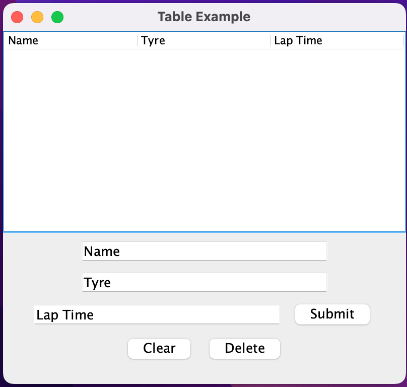

# RT-System

Race timing system

This is a simple Java-based lap time tracker application using Swing for its GUI. The application allows users to add, save, load, clear, and delete lap time entries. The entries are stored in a table and are saved to a text file called "laps.txt" for persistence.



## Features

- Add lap time entries with Name, Tyre, and Lap Time information.
- Save lap time entries to a text file (laps.txt) for future use.
- Load previously saved lap time entries from the laps.txt file.
- Clear all lap time entries in the table and the laps.txt file.
- Delete specific lap time entries from the table and the laps.txt file.

## Usage

1. Clone this repository to your local machine.
2. Compile the `Table.java` file using the following command:

```bash
javac Table.java
```

## Application Structure

The application is a single class, Table, which extends the JFrame class from the Swing library. The class is responsible for creating and managing the application window, the table, and the input fields for adding and managing lap time entries.

### Methods

- addEntry(String name, String tyre, String lapTime): Adds a new entry to the table.
- saveLap(String name, String tyre, String lapTime): Saves a lap entry to the "laps.txt" file.
- loadLaps(): Loads lap data from the "laps.txt" file and adds it to the table.
- clearLapTimes(): Clears the "laps.txt" file by overwriting it with an empty string.
- clearTableData(): Clears all data from the table.
- deleteLapTime(String name, String tyre, String lapTime): Deletes a lap time from the "laps.txt" file.
- deleteTableRow(String name, String tyre, String lapTime): Deletes a row from the table based on the provided data.


 

